class: center, middle

Ces slides en ligne : http://datactivi.st/saintmande/

Les productions de Datactivist sont librement réutilisables selon les termes de la licence [Creative Commons 4.0 BY-SA](https://creativecommons.org/licenses/by-sa/4.0/legalcode.fr).

---
class:middle, center
## Echauffement : 5 minutes, 20 données

Vous avez 5 minutes

Vous devez trouver 20 données dans notre environnement immédiat

Pas de recours aux écrans !

.footnote[[source](http://infolabs.io/5-minutes-20-donnees)]
---
class:middle, center
## Objectifs de la journée

- Comprendre ce qu'est une donnée

- Appréhender la variété des types de données existantes

- Comprendre les "nouveaux habits des données" : data science, big data, open data

- Appréhender les enjeux attachés aux données

---
class:center,inverse, middle
# Qu'est-ce qu'une donnée ?
---
class:center,inverse, middle
#D'après vous ?
---
## Petite sociologie historique de la quantification
.pull-left[.middle[La statistique est à la fois :

  + **outil de gouvernement** (_Statistik_ - 18e siècle), et
  
  
  + **outil de preuve** (_statistics_ - 19e siècle)]]
.pull-right[]
---
  
## [Quantifier, c'est convenir puis mesurer](http://www.pressesdesmines.com/media/extrait/PourSocioHistExtr.pdf)

.pull-left[
> Le verbe quantifier est employé ici dans un sens large : **exprimer et
faire exister sous une forme numérique ce qui, auparavant, était exprimé par
des mots et non par des nombres**. 

>En revanche, l’idée de mesure, inspirée de
l’épistémologie traditionnelle des sciences de la nature, implique que quelque
chose existe sous une forme déjà mesurable selon une métrologie réaliste,
comme la hauteur de la Tour Eiffel. ]
.pull-right[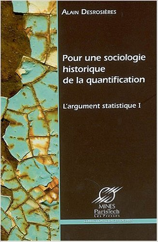]
---
# “Datafication” : la mise en données du monde
> “L'immense gisement de données numériques découle de la capacité à paramétrer des aspects du monde et de la vie humaine qui n'avaient encore jamais été quantifiés. On peut qualifier ce processus de **« mise en données » (datafication)**. 

> […] “La mise en données désigne autre chose que la numérisation, laquelle consiste à traduire un contenu analogique - texte, film, photographie - en une séquence de 1 et de 0 lisible par un ordinateur. Elle se réfère à une action bien plus vaste, et aux implications encore insoupçonnées : **numériser non plus des documents, mais tous les aspects de la vie**.”

.footnote[[Kenneth Cukier, “Mise en données du monde, le déluge numérique”](https://www.monde-diplomatique.fr/2013/07/CUKIER/49318)]
---
# “Datafication” : la mise en données du monde
> “L'immense gisement de données numériques découle de la capacité à paramétrer des aspects du monde et de la vie humaine qui n'avaient encore jamais été quantifiés. On peut qualifier ce processus de **« mise en données » (datafication)**. 

> […] “La mise en données désigne autre chose que la numérisation, laquelle consiste à traduire un contenu analogique - texte, film, photographie - en une séquence de 1 et de 0 lisible par un ordinateur. Elle se réfère à une action bien plus vaste, et aux implications encore insoupçonnées : **numériser non plus des documents, mais tous les aspects de la vie**.”

.footnote[[Kenneth Cukier, “Mise en données du monde, le déluge numérique”](https://www.monde-diplomatique.fr/2013/07/CUKIER/49318)]
---

# La "nombrification" du monde
.pull-left[]
.pull-right[
> La numérisation ne serait pas survenue sans une "nombrification" préalable qui consiste à quantifier de plus en plus d'aspects de notre expérience du réel.

> **Au commencement était le verbe, il semble à la fin que tout devient nombre.**

> Personne ne saurait parler sérieusement de l'état de la société et discuter politique sans se référer aux informations quantitatives. ]

---
## Aux sources de la mise en données du monde
.pull-left[
- Rencontre, dans la Californie des années 1960, entre la Nouvelle Gauche et les Nouveaux Communalistes sur fond de LSD et de recherche militaire

- L'inspiration de la cybernétique (N. Wiener) : objets techniques et êtres humains constituent un même système sociotechhnique, régulé par l'information

- Exemple de Steward Brand, fondateur du _Whole Earth Catalog_ puis de Wired => ["Forest Gump de l'Internet"](https://questionsdecommunication.revues.org/8619)]
.pull-right[
]

---
class:middle
# Le nouveau positivisme des données
> If you asked me to describe the rising philosophy of the day, I’d say it is data-ism. 
We now have the ability to gather huge amounts of data. This ability seems to carry with it certain cultural assumptions — that everything that can be measured should be measured; that data is a transparent and reliable lens that allows us to filter out emotionalism and ideology; that data will help us do remarkable things — like foretell the future.

Jeff Brookes, éditorialiste NY Times

---
## La pyramide Data-Information-Knowledge-Wisdom
.pull-left[
[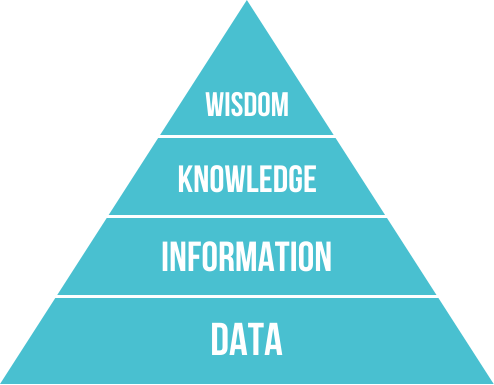](https://commons.wikimedia.org/w/index.php?curid=37705247)
]

.pull-right[Attribuée à [Russell Ackoff](http://en.wikipedia.org/wiki/Russell_L._Ackoff), 1989

Les données peuvent être des :

- faits
- signal/stimulis
- symboles]
---
## Etymologie

Latin : _dare_ (donner) > _datum_ (donné) > _data_ (donnés)
   
Ce qui est évident, va de soi, est accepté sans discussion

  

> From its first vernacular formulation, the existence of a datum has been independent of any
consideration of corresponding ontological truth. When a fact is proven false, it ceases
to be a fact. False data is data nonetheless.

.footnote[[Rosenberg, 2013](https://mitpress.mit.edu/books/raw-data-oxymoron)]
---
class:middle
## Usage de "data"

.pull-left[
Le sens moderne apparaît à la fin du 18e siècle. 

Renvoie à des expériences, des collectes d'éléments.]
.pull-right[]
---
## "Raw data" is an oxymoron
.pull-left[
> Data are always already “cooked” and never entirely “raw.”

> Data need to be imagined _as_ data to exist and function as such, and the imagination of data entails an interpretive base.]
.pull-right[
]

.footnote[[Source](https://mitpress.mit.edu/books/raw-data-oxymoron)]
---
# Vers une définition des données
.pull-left.reduite[

]
.pull-right[
> **Data are commonly understood to be the raw material produced by abstracting the world into
categories, measures and other representational forms – numbers, characters, symbols, images,
sounds, electromagnetic waves, bits – that constitute the building blocks from which information and knowledge are created.**

⏺ enregistrabilité

🏗> briques de base ("buildings blocks")]

---
class:middle

# Données ou obtenues ? *Data or capta* ?

> Technically, then, what we understand as data are actually capta (derived from the Latin capere, meaning ‘to take’); those units of data that have been selected and harvested from the sum of all potential data.

[Kitchin, 2014](https://books.google.fr/books?hl=fr&lr=&id=GfOICwAAQBAJ&oi=fnd&pg=PP1&dq=kitchin+data+revolution&ots=pcyfMTZh-V&sig=dQyPTL3AIN_4RdWvtBFw4VjdAa4#v=onepage&q=kitchin%20data%20revolution&f=false)

> « Décidément, on ne devrait jamais parler de “données”, mais toujours d’“obtenues”. » 

Bruno Latour, 1993

---

class:center, middle, inverse
# Données, données... quelles données ?

---
## Données quantitatives et qualitatives

- Données quantitatives : enregistrées sous forme de nombres
  + nominale (marié/célibataire/divorcé/veuf)
  + ordinale (faible, moyen, fort)
  + intervalles (température en degrés Celsius)
  + ratio (taille en cm)

- Données qualitatives : non numérique => texte, image, vidéo, son, musique...
  + peut être convertie en données quantitatives
  + mais comment ?
  + risque de perdre la richesse des données originales
  + analyse qualitative

---
## Données structurées et non structurées

Données structurées : dotées d'un modèle

  + Ex : base de données relationnelle SQL
  + Lisibles machine
  + Faciles à analyser, manipuler, visualiser...

Données semi-structurées : pas de modèle prédéfini. 
Structure irrégulière, implicite... mais données organisées néanmoins, ensemble raisonnable de champs

  + Exemple : XML, JSON
  + possible de trier, ordonner et structurer les données

Données non structurées : pas de structure commune identifiable
  + Exemple : BDD NoSQL
  + généralement qualitatives
  + difficilement combinées ou analysées quantitativement
  + les données non structurées croitraient 15x plus que les données structurées
  + machine learning de + en + capable d'analyser ces données. 

---
## Données capturées et données échappées

- Données capturées : observation, enquête, expérimentation, prise de notes, senseurs... => intention de générer des données
- Données échappées : sous-produit d'un engin ou d'un système dont la fonction première est autre
- Données transitoires : échappées qui ne sont jamais examinées, transformées ou analysées

=> brutes car non converties ou combinées

## Données dérivées

- Résultat d'un traitement ou une analyse supplémentaire de données capturées. 
- Souvent le résultat d'un modèle

---
## Données dérivées

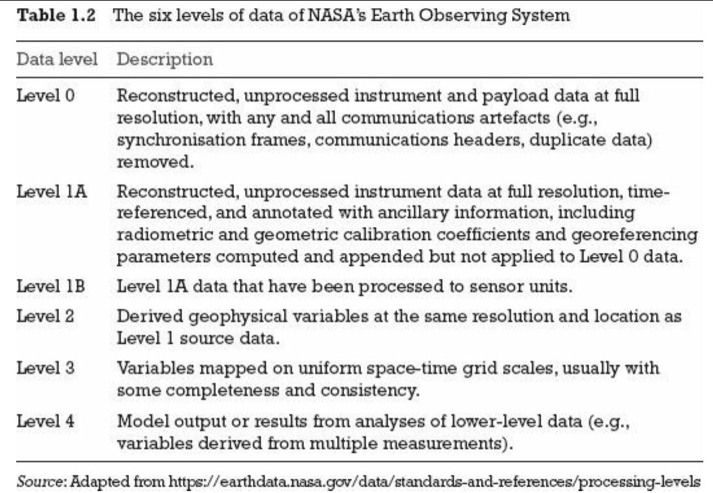
---
##Index, attributs, métadonnées

- index : permettent l'identification et la mise en relation. Essentiels pour enrichir les données
-

- attributs : représentent les aspects d'un phénomène, mais ne sont pas des index (pas identifiants uniques)
-
 metadata : données sur les données. Peuvent être descriptives, structurelles ou administratives. Standard : Dublin Core. 

---
class:inverse, middle, center
#La data science
### Ouvrons la boite noire

---
class:middle

## Au commencement était la statistique

- une vieille science (18e siècle), pour aider les États (_Statistik_) mais aussi des entreprises privées (au départ, les assureurs => actuariat)

- fondée sur les probabilités

- faite par des mathématiciens

- forte dimension théorique

---
class:middle
## Data science : les nouvelles statistiques ?

> I keep saying the sexy job in the next ten years will be statisticians. People think I’m joking, but who would’ve guessed that computer engineers would’ve been the sexy job of the 1990s?

Hal Varian (Chief economist, Google), The McKinsey Quarterly, January 2009

> “I think data-scientist is a sexed up term for a statistician”

[Nate Silver](http://www.statisticsviews.com/details/feature/5133141/Nate-Silver-What-I-need-from-statisticians.html)
---

## Data science is the new statistics?

.center[.reduite[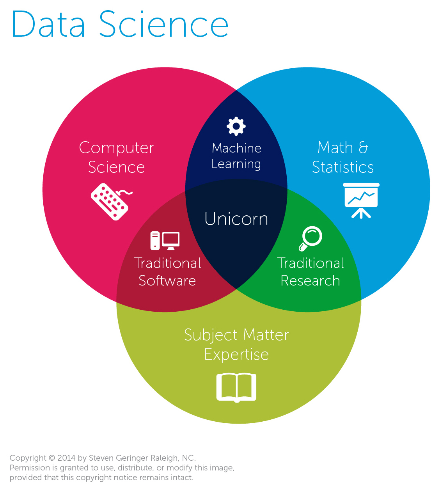]]
---
## Développement de la puissance de calcul

---
## Développement de la capacité de stockage

---
## Développement de la capacité de stockage

---
# Que fait-on une fois qu'on a des données ?

### Analyse de données exploratoire
.pull-left[- Exploratory Data Analysis (Tukey, 1977) : pas d'hypothèse préalable à tester, plutôt pour générer des hypothèses. Rôle de la datavisualisation 

- Test d'hypothèse]

.pull-right[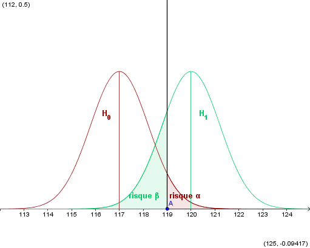]
---
# Que fait-on une fois qu'on a des données ?

### Modélisation
.pull-left[- Un modèle réduit de la réalité pour analyser, expliquer ou prédire

Modéliser, c’est mettre en relation une *variable expliquée*
(dépendante / prédite) et une ou plusieurs *variables explicatives*
(indépendantes / prédicteurs).

Implique de faire des hypothèses sur la spécification du modèle :

- variables explicatives
- distribution des erreurs]

.pull-right[]
---
class:center, middle

## All models are wrong, some are useful

> Since all models are wrong the scientist cannot obtain a "correct" one by excessive elaboration. On the contrary following William of Occam he should seek an economical description of natural phenomena. 

[George Box](https://dx.doi.org/10.1080%2F01621459.1976.10480949)

---
## Et le machine learning alors ?

- Fondamentalement, modélisation et machine learning ne sont pas différents, du point de vue d'un statisticien : modéliser un $Y$ en fonction d'un vecteur de $X_i$

- une des différences principales toutefois : veut-on prévoir ou comprendre/analyser ?

- en pratique : machine learning porte sur des données plus complexes que la modélisation traditionnelle

- Souvent beaucoup de valeurs manquantes 
---
## Le cas du deep learning

### Comment apprendre à un ordinateur à lire ?

---
## Le cas du deep learning

Un perceptron

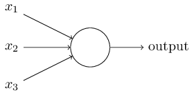

Un (petit) réseau de neurones

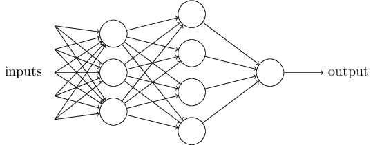

???
le perceptron de Frank Rosenblatt à la fin des années 1950, capable de reconnaître des images après une phase dite « d’apprentissage ». Les valeurs des « synapses » sont ajustées jusqu’à ce que la réponse soit correcte. Le système est ensuite capable, face à une image inconnue, de la classer dans l’une des catégories apprises (chien, chat, voiture…). Imaginez que vous vouliez obtenir une certaine couleur à partir de trois pots de peinture, rouge, jaune, bleu. Vous mettez plus ou moins de l’une et de l’autre jusqu’à trouver le bon mélange. C’est exactement ce que fait le perceptron ; les « synapses » correspondant au volume des trois couleurs.
Finalement, les descendants actuels du perceptron font toujours la même chose. Prendre des informations en entrée, modifier les « connexions » à l’intérieur pour trouver la bonne réponse, de façon à sortir de nouvelles données permettant de classer, de reconnaître et simplifier les entrées inconnues… Ce type d’intelligence se distingue de celui qui consistait à élaborer des règles à suivre pour la machine (règles de grammaire, recherche de certains traits dans une image…).

---
## Le cas du deep learning

---

## Le pipeline de données

---
## Vérifier les données

---
## Vérifier les données

[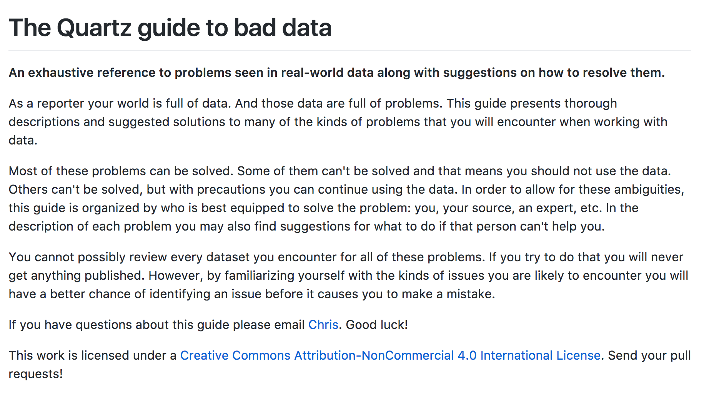](https://github.com/Quartz/bad-data-guide)

---
## Nettoyer les données

Paradigme du [_tidy data_](http://vita.had.co.nz/papers/tidy-data.pdf) (Hadley Wickham)

> “Happy families are all alike; every unhappy family is unhappy in its own way.” – Leon Tolstoï 

> “Tidy datasets are all alike, but every messy dataset is messy in its own way.” – Hadley Wickham

**Principes du *tidy data* **
- chaque variable correspond à une colonne
- chaque observation/individu correspond à une ligne
- chaque type d'unité d'observation correspond à une table
- chaque cellule comporte une donnée 

---
# Visualiser les données
### Choisir un format de visualisation
.reduite[[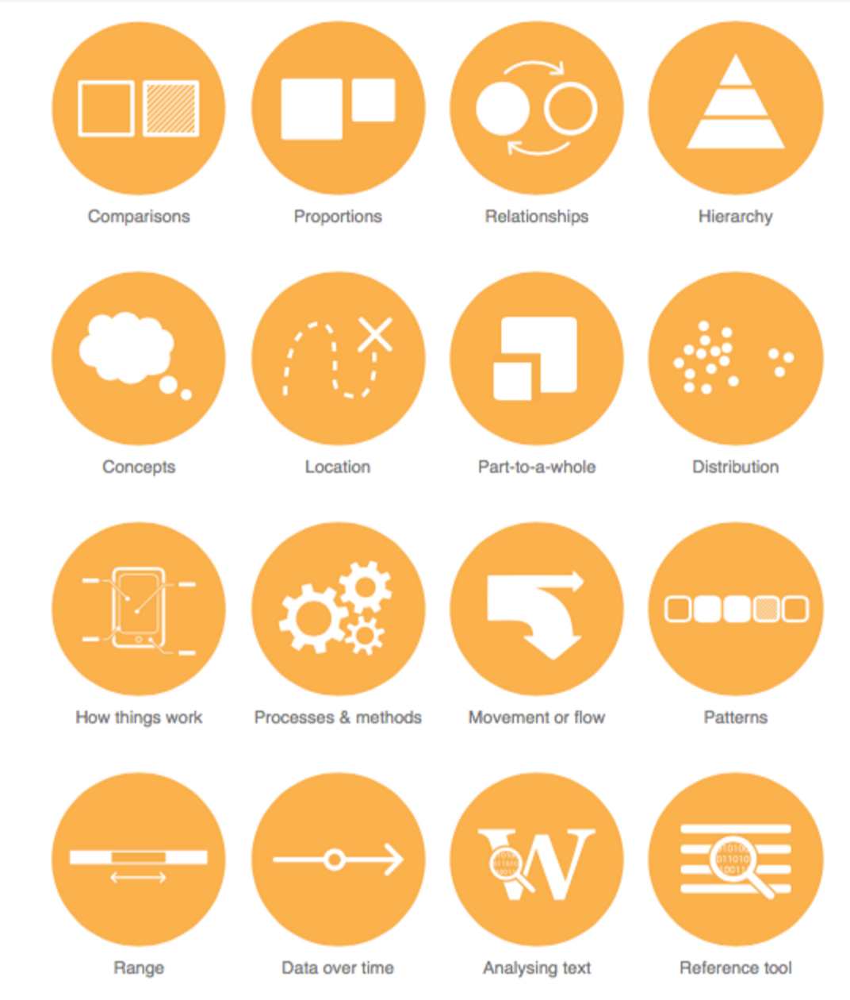](http://www.datavizcatalogue.com/)]

---
# Visualiser les données
### Trouver un outil
.reduite[]
---
class:inverse, middle, center
# De l'open data au big data
---
## Open data : quelques jalons historiques

---
## Open data: les bénéfices pour une collectivité

### Organisationnels
Gain de temps dans les procédures de demandes de données, valorisation du travail des agents, nouvelles possibilité de croisement et d’exploitation des données en interne, possibilité de mutualisation des outils…

### Système d’information
Amélioration de la qualité des données, cartographie du SI, soutien à l’open source et la souveraineté du SI, possibilité de partage interne pour les données non ouvrables, avancement de projets de dématérialisation…

---
## Open data: les bénéfices pour une collectivité
###Communication
Transparence renforcée, visualisation de données pour la communication, suivi des engagements, implication des citoyens… 

###Economie
Soutien aux startups, rationnalisation de la politique d’achat par l’accès à de nouveaux services réutilisant les données, développement ouvert de services au public par des hackathons et des appels à projets… 

---
## Les données ouvertes en résumé

.reduite[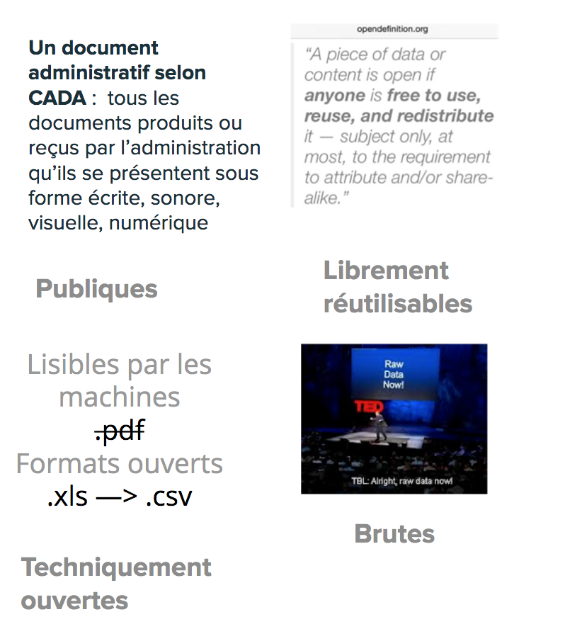]
---
## Big data

---
# L'obsession du volume de données
.pull-left[
**Quelques chiffres omniprésents** : 
- le volume de données produit double tous les 3 ans (Gantz & Reisel 2011)
- 90% des données créées dans les deux dernières années (IBM 2012)
- 40% : croissance annuelle de la production de données (Maniyka et al. 2011) 

**Problèmes de cette approche** : 
- Estimations guidées par des intérêts commerciaux
- Ne définit pas ce que sont ces données
- Résume le big data au Volume
-Explique mal la mise en données du monde
]
.pull-right[

]
---
# Les promesses du big data
Kitchin (2014) résume les promesses du big data : 
- **“Governing people”** : dans la continuité de la statistique, améliorer la connaissance de l’administration et prédire les crimes

- **“Managing organisations”** : améliorer le fonctionnement de toutes les composantes de l’organisation par l’exploitation des données

- **“Leveraging value and producing capital”** : micro-ciblage marketing, optimisation des magasins et des opérations, efficience de la chaine

- **“Creating Better places”** : gouverner les villes avec des données (smart city) 

- **Un nouveau paradigme scientifique** : une nouvelle ère guidée par les corrélations

---
## Linked data
.pull-left[
- poussé par W3C et Tim Berners-Lee
-
- eb sémantique / web des données
-
 RDF / SPARQL
-
 wikidata => http://projetjourdain.org/network/index.html]

.pull-right[

]
---
## API
.pull-left[
- Application programming interface => un programme vu de la surface

- les machines parlent aux machines

- donnée dynamique => ouverture potentiellement limitée et contrôlée 

- un exemple : [overpass turbo](https://overpass-turbo.eu/)]
.pull-right[

]
---
class:inverse,center, middle
#Merci
---
# Un ROTI avant le déjeuner
[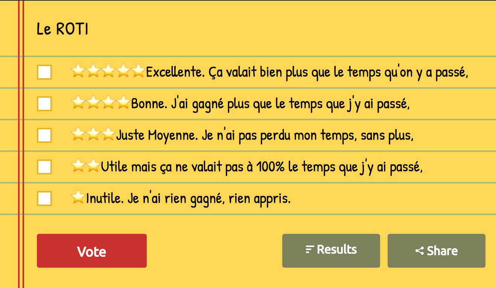](http://www.strawpoll.me/13484643)